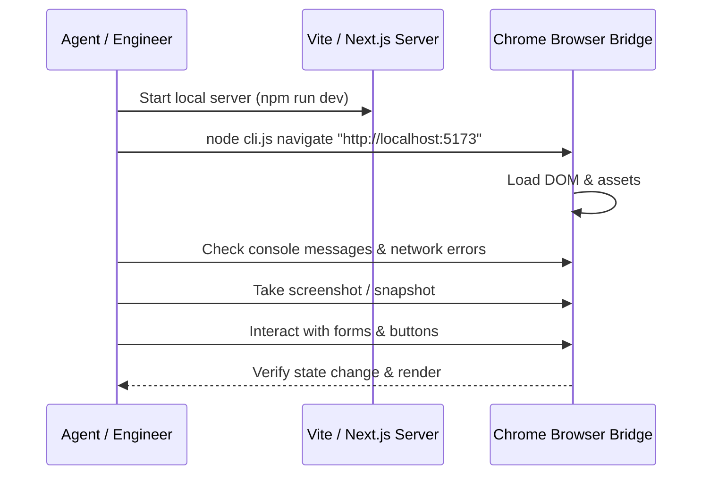

# Agent Browser: High-Velocity Script & CLI Orchestration

The `agent-browser` skill focuses on programmatic, shell-driven, and REPL-driven browser automation. Where manual interactive browsing is deliberate, `agent-browser` executes rapid verification loops, inspects local development servers (Vite, Next.js, React, Node), parses console errors, and drives CLI commands with sub-second execution speeds.

---

## 1. Fast CLI Pipeline Interface

The Antigravity Browser Bridge provides a zero-overhead Node.js CLI:
```bash
node /home/jayant/.gemini/antigravity/browser-bridge/cli.js <command> [args]
```

### Core CLI Commands Matrix

| Command | Shorthand | Description | Example |
|---|---|---|---|
| `status` | `st` | Check daemon status & connected profiles | `node cli.js status` |
| `list-tabs` | `tabs` | List all open tabs across all Chrome windows | `node cli.js list-tabs` |
| `activate-tab` | `act` | Focus specific tab by ID | `node cli.js activate-tab 459840364` |
| `navigate` | `nav` | Navigate active tab to URL | `node cli.js navigate "http://localhost:3000"` |
| `snapshot` | `snap` | Print concise accessibility snapshot | `node cli.js snapshot` |
| `click` | `c` | Click selector or (x, y) coordinates | `node cli.js click "button.submit"` |
| `find-and-click`| `fc` | Locate text and click matching element | `node cli.js find-and-click "Log In"` |
| `type` | `t` | Type text into active or selected element | `node cli.js type "admin@test.com"` |
| `paste` | `p` | Atomic clipboard paste | `node cli.js paste "bulk payload"` |
| `press` | `k` | Dispatch keyboard key | `node cli.js press Enter` |
| `scroll` | `sc` | Scroll active viewport | `node cli.js scroll 0 500` |
| `batch` | `run` | Execute JSON batch of actions | `node cli.js batch '[{"type":"click","selector":"#btn"}]'` |
| `reload-extension`| `re` | Hot-reload extension v1.4.0 | `node cli.js reload-extension` |

---

## 2. Ref Lifecycle & Numerical Handle Indexing

In high-speed test automation, snapshotting full DOM trees produces too many tokens. The Ref Indexing pattern compresses the accessibility tree into numbered tags:

```
[e1] button "Sign in"
[e2] input[text] "Username"
[e3] input[password] "Password"
[e4] link "Forgot password?"
```

To interact with reference `e2`:
- The CLI translates `e2` into the cached CSS selector or coordinate center `(x, y)`.
- Action is dispatched instantly: `click e2`, `type e2 "admin"`.
- *Rule*: Whenever the page navigates, submits a form, or opens a modal, the ref index is invalidated and a fresh snapshot must be taken.

---

## 3. Local Dev-Server Verification Workflow

When developing or debugging web applications locally:



### Key Verification Checks:
1. **Console Error Interception**: Ensure zero uncaught JavaScript exceptions, React hydration errors, or unhandled promise rejections.
2. **Network 4xx/5xx Audit**: Verify all bundled chunks, API routes, and assets load with HTTP 200/304.
3. **Viewport Responsiveness**: Test at 1440px desktop, 768px tablet, and 375px mobile dimensions.

---

## 4. Deep-Dive References

- **[Ref Lifecycle & Dynamic Invalidation](references/ref-lifecycle.md)**: Handling ref assignment, DOM mutations, and snapshot caching.
- **[Semantic Locators in Single-Page Apps](references/semantic-locators.md)**: Finding elements in React/Next.js/Tailwind apps without fragile CSS classes.
- **[Dev Server Verification Playbook](references/dev-server-verification.md)**: Automated end-to-end verification checklist for Vite, Next.js, and Express apps.
