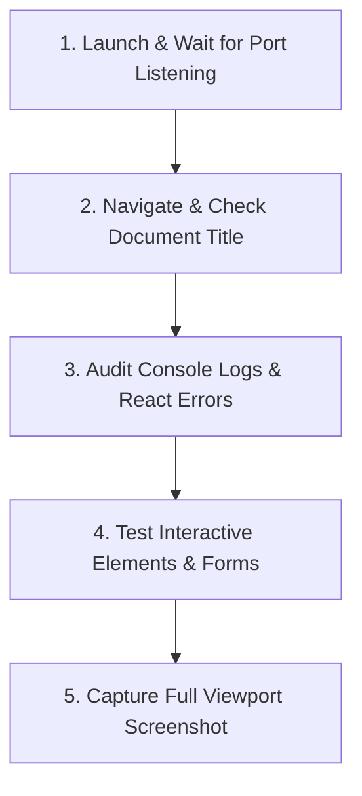

# Dev-Server Verification Playbook (Vite / Next.js / React)

When developing web features, agents must autonomously verify their UI and API changes before reporting success to the user.

---

## 1. Automated Verification Sequence

Follow this 5-step checklist for every web development task:



### Step 1: Wait for Port Listening
Before navigating, ensure the local server is accepting connections:
```bash
# Verify port is listening (e.g. 3000, 5173, 8080)
ss -tulpn | grep -E ':(3000|5173|8080)'
```

### Step 2: Navigate to Development URL
```bash
node /home/jayant/.gemini/antigravity/browser-bridge/cli.js navigate "http://localhost:5173"
```

### Step 3: Audit Console Logs for Errors
In `browser_evaluate`, query captured window errors:
```javascript
() => {
  const errors = window.__ANTIGRAVITY_ERRORS || [];
  return {
    hasErrors: errors.length > 0,
    errors: errors.slice(0, 5)
  };
}
```
Or check Chrome DevTools console messages for:
- Uncaught `TypeError` or `ReferenceError`
- React hydration mismatches (`Warning: Text content did not match...`)
- Missing module imports or 404 bundle chunks

### Step 4: Test Interactive User Flows
- Fill inputs and submit forms.
- Click dropdowns, modals, and tabs.
- Ensure loading spinners resolve into real UI.

### Step 5: Visual Screenshot Audit
Take a screenshot via `browser_screenshot` to confirm visual layout, alignment, typography, and responsive margins.
