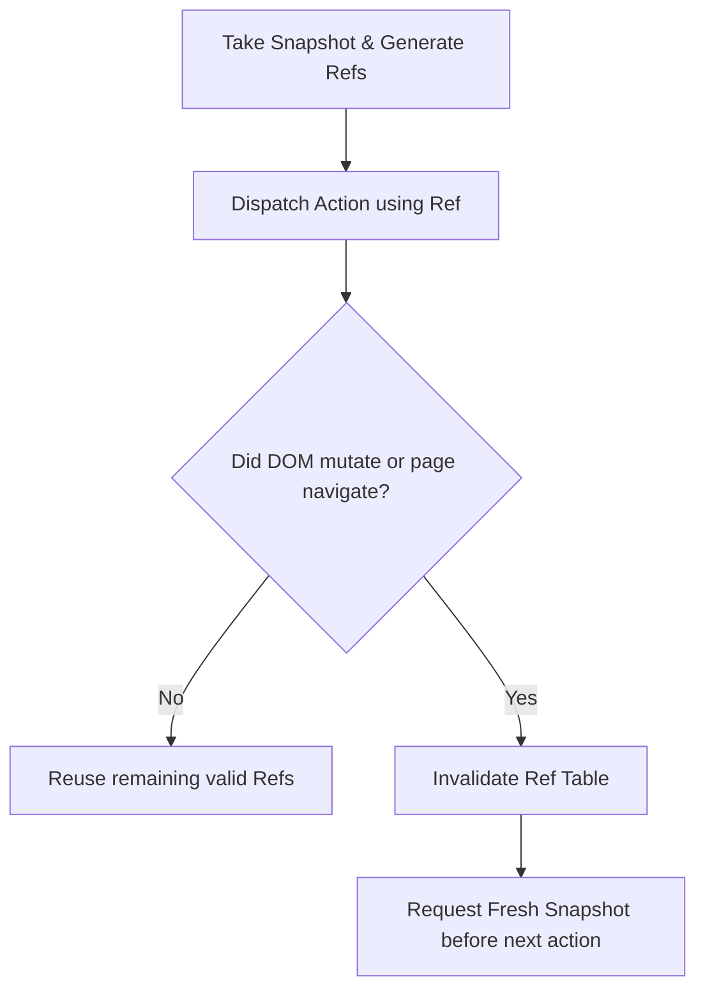

# Ref Lifecycle & Invalidation Engineering

Ref indexing is an optimization pattern that maps short numerical or alphanumeric tokens (e.g. `@e1`, `@e2`, `[1]`, `[2]`) to DOM elements, reducing prompt token consumption by up to 80%.

---

## 1. How Element Refs are Generated

During snapshot generation:
1. Traverse interactive DOM elements (`a`, `button`, `input`, `select`, `textarea`, `[role="button"]`, `[tabindex]`).
2. Filter out non-visible elements (`offsetParent === null`, `visibility: hidden`, `display: none`).
3. Assign sequential handles `e1`, `e2`, `e3`...
4. Store mapping: `refId -> { selector, xpath, boundingBox: { x, y, width, height } }`.
5. Return compressed tree:
```
[e1] button: "Get Started"
[e2] a: "Pricing"
[e3] input[type="email"]: "Enter your email"
```

---

## 2. Invalidation Conditions

A ref cache becomes **invalid** immediately upon:
1. **URL Navigation**: Any change to `window.location.href` or pushState history.
2. **Form Submission**: Submitting a form typically refreshes or substantially alters the page DOM.
3. **Modal or Dialog Open/Close**: Mounts or unmounts a whole subtree, altering tab indices.
4. **Accordion / Tab Switch**: Changes visibility of contained elements.
5. **Timer-based DOM updates**: React Query / SWR background refetching that replaces list items.

---

## 3. Safe Execution Protocol



**Rule**: Never attempt to interact with a ref after an action that modifies page state. Always acquire an updated snapshot first.
