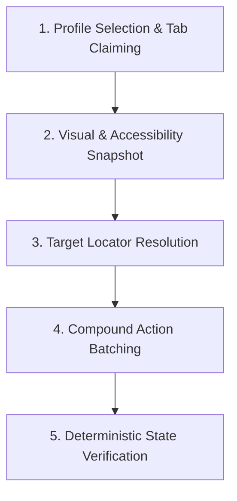

# Browser Control: Elite Automation & Orchestration

The `browser-control` skill provides deterministic, high-throughput browser interaction across complex modern web applications (SPAs, React, Angular, Vue, canvas-heavy apps, and enterprise intranets). It bridges Antigravity tools (`mcp_antigravity_browser_*`), Chrome DevTools Protocol, and the native messaging extension to interact with web pages exactly like a human engineer, with visual cursor guidance visible 24/7.

---

## 0. Skill Router: Choosing the Right Browser Tooling

Before executing any browser task, consult this routing matrix:

| Task Domain | Primary Skill | Supporting Reference |
|---|---|---|
| **Google Sheets & Financial Modeling** | `browser-google-sheets` | `spreadsheets-mastery` |
| **Local Dev-Server & Fast Script Testing** | `agent-browser` | `references/dev-server-verification.md` |
| **End-to-End QA, Viewports & Playwright** | `playwright-interactive` | `references/qa-checklists.md` |
| **General Web Automation & SPA Navigation** | `browser-control` (This Skill) | `references/accessibility.md` |

---

## 1. Non-Disruptive Background Execution & Safe Tab Ownership

1. **Background by Default (`active: false`)**:
   - When creating tabs via `browser_new_tab` or `agy-browser new`, tabs are opened silently in the background.
   - The user can see the tab appear in their browser tab bar, but their active window and focused tab are **never stolen**.
2. **Hardware Focus Emulation (Zero Throttling)**:
   - Chrome normally throttles background timers and animations to save battery. The Antigravity bridge automatically enables `Emulation.setFocusEmulationEnabled` via CDP.
   - Background web apps and single-page apps run at **100% full foreground speed** without screen disruption.
3. **Safe Tab Ownership (`agentOwnedTabs`)**:
   - Agents track tabs created in the current session.
   - Agents must **never hijack an existing unknown tab** where the user is working (e.g. WhatsApp, personal email, active documents).
   - If a task explicitly directs the agent to inspect or use an existing tab, pass `{ "allowExistingTab": true }`.
4. **Clean Session Teardown (`browser_close_agent_tabs`)**:
   - At the conclusion of a task, call `browser_close_agent_tabs` or `agy-browser cleanup` to close scratch tabs without touching the user's personal tabs.

---

## 2. Core Operating Philosophy: Compound Batching (Sub-Second TPS)

Traditional agent browser interaction suffers from crippling round-trip latency:
- Turn 1: Click search box -> Wait for LLM
- Turn 2: Type search term -> Wait for LLM
- Turn 3: Press Enter -> Wait for LLM
- Turn 4: Wait for results -> Wait for LLM

**The Compound Batching Rule**:
Whenever a sequence of actions is deterministic, never execute them across separate tool turns. Group them into a single `browser_run_actions` tool call or an equivalent evaluated script:

```json
{
  "actions": [
    { "type": "click", "selector": "input[type='search']" },
    { "type": "type", "text": "production incident logs" },
    { "type": "press_key", "key": "Enter" },
    { "type": "wait", "ms": 500 }
  ]
}
```

This reduces execution time from 15–30 seconds down to <400 milliseconds.

---

## 3. The 5-Step Interaction Lifecycle



### Step 1: Profile Selection & Tab Claiming
1. Run `browser_list_tabs` or `agy-browser tabs` to inspect open tabs and active Chrome profiles (`devops@qtloads.com`, default, etc.).
2. If the target page was created by the agent in this session (`agentOwned: true`), reuse it.
3. If creating a new page, call `browser_new_tab` (opens in background by default).
4. Do not hijack user-owned tabs (`agentOwned: false`) without explicit instruction.

### Step 2: Visual & Accessibility Snapshot
1. Inspect the page structure using `browser_snapshot`.
2. Extract the accessibility tree (roles, accessible names, states: `expanded`, `selected`, `checked`).
3. Take a `browser_screenshot` when visual positioning, layout overlap, or canvas elements are involved.
4. The 24/7 visual cursor will automatically render on the active tab and follow all click/hover coordinates.

### Step 3: Target Locator Resolution
Prioritize locators in this strict order:
1. **Semantic Accessibility Selectors**: `button:has-text("Submit")`, `[role="button"][name="Save"]`, `[aria-label="Filter"]`.
2. **Deterministic Data Attributes**: `[data-testid="search-input"]`, `[data-id="row-action"]`.
3. **Fuzzy Text Match**: `browser_find_and_click` with text patterns and tags.
4. **Calculated Coordinates**: Bounding box center coordinates `(x, y)` for canvas surfaces or unexposed custom components.

### Step 4: Compound Action Execution
Dispatch actions via `browser_run_actions`:
- `click`: Triggers visual cursor move + mousedown + mouseup + click.
- `hover`: Moves cursor to target and emits mouseenter/mouseover.
- `type`: Types text with realistic keystroke dispatch.
- `paste`: Atomic text injection into active element without keyboard lag.
- `press_key`: Dispatches key events (`Enter`, `Tab`, `Escape`, `Backspace`, `ArrowDown`, etc.).
- `scroll`: Scrolls target element or window viewport by `(x, y)` delta.
- `wait`: Millisecond sleep between sequential events.

### Step 5: Deterministic State Verification
Always verify completion:
- Check for URL change, new tab creation, or navigation state.
- Check for expected DOM changes: toast notifications, modal appearance, updated table rows.
- If an action failed, immediately consult [Troubleshooting Reference](references/troubleshooting.md).

---

## 4. Tool Reference & CLI Cheatsheet

| MCP Tool | CLI Equivalent | Primary Use Case |
|---|---|---|
| `browser_list_tabs` | `agy-browser tabs` | Discover open tabs & profiles |
| `browser_new_tab` | `agy-browser new [--profile <hint>] <url>` | Create background tab |
| `browser_activate_tab`| `agy-browser activate <tabId> [--bring-to-front]` | Focus or claim tab |
| `browser_navigate` | `agy-browser nav <tabId> <url>` | Go to URL in tab |
| `browser_snapshot` | `agy-browser snap <tabId>` | Fetch accessibility DOM tree |
| `browser_click` | `agy-browser click <tabId> <uid>` | Single click with glowing cursor |
| `browser_find_and_click`| `agy-browser fc <tabId> <selector>` | One-shot fuzzy text clicker |
| `browser_type` | `agy-browser type <tabId> <text>` | Emulate human typing |
| `browser_paste` | `agy-browser paste <tabId> <text>` | Bulk text injection |
| `browser_run_actions` | `agy-browser batch <tabId> '<actions>'` | **Compound action batch runner** |
| `browser_close_tab` | `agy-browser close <tabId>` | Close single tab |
| `browser_close_agent_tabs`| `agy-browser cleanup` | Cleanly close all agent scratch tabs |
| `browser_reload_extension`| `agy-browser reload` | Hot-reload extension v1.4.0 |

---

## 5. Detailed Deep-Dive References

- **[Accessibility & ARIA Guide](references/accessibility.md)**: Semantic locators, aria attributes, focus traps, screen reader patterns.
- **[Tab Claiming & Isolation](references/tab-claiming.md)**: Multi-window coordination, preventing tab collisions, clean tear-down.
- **[CDP Capabilities & Fallbacks](references/cdp-capabilities.md)**: Emulation, network request inspection, dialog handlers.
- **[File Uploads & Choosers](references/file-uploads.md)**: Handling hidden `<input type="file">`, synthetic drag-and-drop file transfers.
- **[Troubleshooting & Recovery](references/troubleshooting.md)**: Diagnosing disconnected daemons, stale element references, canvas traps.
