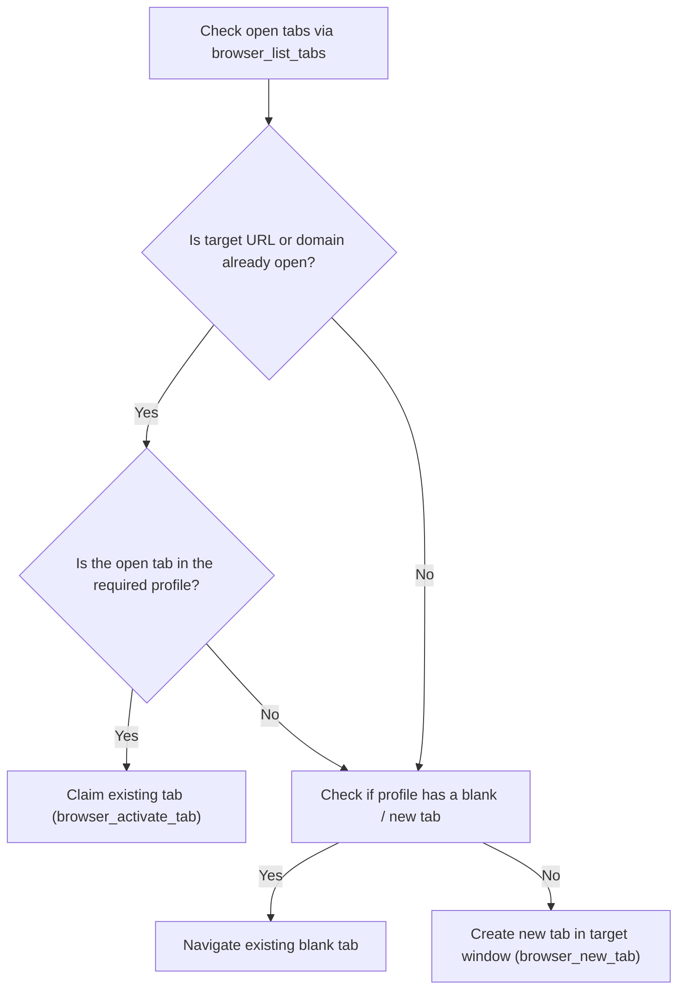

# Multi-Profile Tab Claiming & Isolation Reference

When automating browsers in a production or multi-user environment, users frequently have multiple Chrome profiles (e.g. `devops@qtloads.com`, personal, testing) and dozens of open tabs. Careless automation risks closing the user's active session, typing credentials into public chats, or creating duplicate windows.

---

## 1. Tab Discovery Protocol

Before launching any navigation or interaction:
1. Call `browser_list_tabs`.
2. Inspect the output array:
```json
[
  {
    "id": 459840364,
    "windowId": 459840149,
    "title": "Inbox (2,435) - devops@qtloads.com - QTLOADS Mail",
    "url": "https://mail.google.com/mail/u/0/#inbox",
    "active": true,
    "profileEmail": "devops@qtloads.com"
  },
  {
    "id": 459840387,
    "windowId": 459840083,
    "title": "New Tab",
    "url": "chrome://newtab/",
    "active": true,
    "profileEmail": "unknown"
  }
]
```

---

## 2. Decision Matrix: Claim vs. New Tab



### Golden Rules:
1. **Never duplicate an existing open document**: If a Google Sheet, Grafana Dashboard, or Jira ticket is already open, claim it. Opening a second instance causes edit desynchronization and WebSocket contention.
2. **Reuse idle tabs**: If a window has an empty `chrome://newtab/`, navigate that tab instead of opening an extra one.
3. **Verify Profile Context**: If interacting with AWS, Jenkins, Grafana, or corporate Google Docs, ensure `profileEmail` matches the authenticated work account (`devops@qtloads.com`).

---

## 3. Tab State & Cursor Synchronization

When `browser_activate_tab` is called:
1. The extension brings that tab to the foreground.
2. The 24/7 cursor engine immediately queries the active tab's layout and renders the pointer at the last known coordinates with a glowing aura.
3. If the page is still loading (`status: "loading"`), wait until `status: "complete"` before sending compound keystrokes or clicks.
