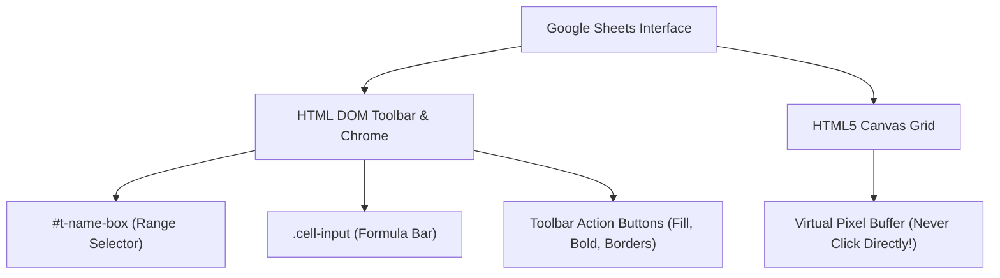

# Google Sheets Automation Mastery

Google Sheets is the primary data and modeling canvas for business, finance, and engineering. However, agents routinely fail on Google Sheets because **cells do not exist in the DOM**. The grid is rendered onto an HTML5 `<canvas>`. Attempting to click cells via DOM queries or pixel guessing results in missed clicks, misaligned inputs, and ruined spreadsheets.

This skill equips Antigravity with the exact methods used by high-performance automation agents to control Google Sheets deterministically, at speeds exceeding 1,000 cells per second.

---

## 1. The Core Architecture: Canvas vs. DOM



### The Three Golden Rules of Google Sheets:
1. **Never Click the Canvas Grid**: You cannot locate cell `B14` via CSS selectors.
2. **Always Navigate via the Name Box (`#t-name-box`)**: Jump to any cell or multi-cell range instantly by typing the coordinates and pressing `Enter`.
3. **Always Ingest Data via Dual TSV + HTML (`browser_paste`)**: Format data as TSV (values) and HTML table (inline CSS colors, badges, borders, alignments) and paste via `browser_paste`. Google Sheets natively parses both simultaneously.

---

## 2. The 4-Step Google Sheets Execution Workflow

### Step 1: Claim or Open the Spreadsheet
1. Use `browser_list_tabs` or `agy-browser tabs` to find the target sheet.
2. If already open, claim it immediately via `agy-browser claim <tabId>` or `browser_claim_tab`.
3. If creating a new sheet, navigate to `https://sheets.new`.

### Step 2: Jump to Target Cell or Range
Jump using a single compound batch call via `browser_run_actions` or CLI:
```bash
agy-browser fc <tabId> "#t-name-box"
agy-browser type <tabId> "A1" --enter
```

### Step 3: Dual Data & Styling Ingestion (TSV + HTML Paste)
Assemble your data grid and CSS styling into a dual TSV + HTML payload.
- Columns separated by `\t`, rows by `\n`.
- HTML table with inline styles (`th` background colors, badges, borders).

Dispatch via `browser_paste`:
```bash
agy-browser paste <tabId> "$tsv_payload" --html "$html_payload"
```
In **one atomic clipboard operation**, data, formulas, header styles, and cell colors are populated instantly.

### Step 4: Formatting & Layout Polish
1. **Auto-Fit Column Widths**: Jump to data columns (e.g. `B:N`) via `#t-name-box` -> click `input[placeholder="Menus"]` -> type `"Resize columns"` -> Enter -> select JFK radio `#waffle-resize-selection-auto-label` -> OK.
2. **Handle Footnote Width Trap**: If a wide footnote is in `A16`, never auto-fit Column A. Set Column A to fixed `120px` via `#waffle-resize-selection-custom-label`, allowing the footnote to overflow.
3. **Freeze Header Row**: Jump to `A1` -> `input[placeholder="Menus"]` -> type `"Freeze 1 row"` -> Enter.

---

## 3. Tool Reference & Method Mapping

| Action | Recommended Tool Call | Speed / Efficiency |
|---|---|---|
| Select Cell / Range | `browser_run_actions` (click `#t-name-box` -> type range -> press `Enter`) | ~150ms |
| Populate Data & Styles | `browser_paste` (dual TSV + HTML table) | ~50ms for 1,000+ cells |
| Single Formula Edit | Focus Formula Bar `.cell-input` or press `F2` -> `browser_type` -> `Enter` | ~200ms |
| Auto-Fit Columns | Jump to range -> `input[placeholder="Menus"]` -> `"Resize columns"` -> Fit | ~250ms |
| Freeze Header | Jump to A1 -> `input[placeholder="Menus"]` -> `"Freeze 1 row"` | ~200ms |
| Add Sheet Tab | `browser_find_and_click` on `div[aria-label="Add Sheet"]` or `Shift+F11` | ~300ms |
| Export & Verify | Download via URL `/export?format=xlsx` -> Python validation | 100% verified |

---

## 4. Deep-Dive References

Consult the specialized references in this skill:
- **[Column Auto-Fit & Layout Polish](references/column-resizing.md)**: Deterministic auto-fitting, JFK radio selectors, footnote trap mitigation, and row freezing.
- **[TSV & HTML Bulk Ingestion](references/tsv-bulk-ingestion.md)**: Dual DataTransfer payload injection, escaping quotes, formulas, and styled HTML tables.
- **[Canvas vs DOM Mechanics](references/canvas-vs-dom.md)**: Deep dive into the Google Sheets rendering engine, virtual viewport, and why DOM clicks fail.
- **[Name Box Recipes](references/name-box-recipes.md)**: Advanced range selections: whole columns, disjoint ranges, named ranges, sheet prefixes (`Sheet2!B5:G20`).
- **[Toolbar & Shortcuts Cheatsheet](references/toolbar-and-shortcuts.md)**: Complete keyboard shortcut matrix and reliable DOM selectors for Google Sheets toolbar controls.
- **[Sheet Tabs Management](references/sheet-tabs.md)**: Tab creation, renaming, color coding, moving, and cross-tab formula syntax.
- **[Export Verification](references/export-verification.md)**: Headless XLSX/CSV verification script using Python to guarantee formula correctness and formatting parity.
