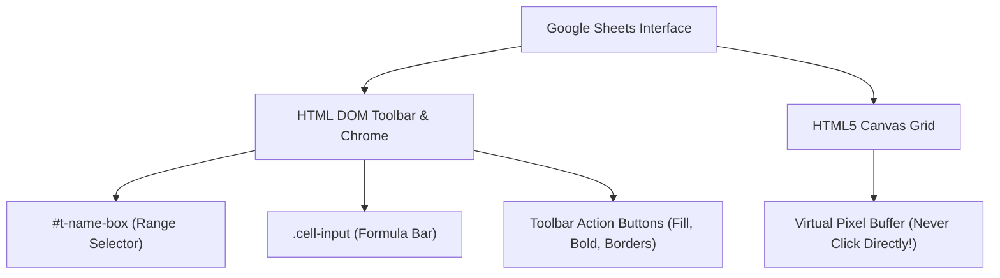

# Google Sheets Automation Mastery

Google Sheets is the primary data and modeling canvas for business, finance, and engineering. However, agents routinely fail on Google Sheets because **cells do not exist in the DOM**. The grid is rendered onto an HTML5 `<canvas>`. Attempting to click cells via DOM queries or pixel guessing results in missed clicks, misaligned inputs, and ruined spreadsheets.

This skill equips Antigravity with the exact methods used by high-performance automation agents to control Google Sheets deterministically, at speeds exceeding 1,000 cells per second.

---

## 1. The Core Architecture: Canvas vs. DOM



### The Three Golden Rules of Google Sheets:
1. **Never Click the Canvas Grid**: You cannot locate cell `B14` via CSS selectors.
2. **Always Navigate via the Name Box (`#t-name-box`)**: Jump to any cell or multi-cell range instantly by typing the coordinates and pressing `Enter`.
3. **Always Ingest Data via Bulk TSV (`Ctrl+V`)**: Format data as Tab-Separated Values and paste via `browser_paste`. Google Sheets natively parses `\t` as column delimiters and `\n` as row delimiters.

---

## 2. The 4-Step Google Sheets Execution Workflow

### Step 1: Claim or Open the Spreadsheet
1. Use `browser_list_tabs` to find the active sheet.
2. If already open, switch to it with `browser_activate_tab`.
3. If creating a new sheet, navigate to `https://sheets.new`.

### Step 2: Jump to Target Cell or Range
Jump using a single compound batch call via `browser_run_actions`:
```json
{
  "actions": [
    { "type": "click", "selector": "#t-name-box" },
    { "type": "type", "text": "A1" },
    { "type": "press_key", "key": "Enter" },
    { "type": "wait", "ms": 150 }
  ]
}
```
*Note*: Alternatively, press `Ctrl+J` from within the sheet to focus the Name Box.

### Step 3: Bulk Data & Formula Injection (TSV Paste)
Assemble your entire data grid, headers, and formulas into a clean TSV string.
- Columns are separated by `\t` (Tab).
- Rows are separated by `\n` (Newline).
- Formulas start with `=` (e.g. `=SUM(B2:B10)`).

Dispatch via `browser_paste`:
```json
{
  "text": "Quarter\tRevenue\tExpenses\tNet Margin\nQ1 2026\t150000\t95000\t=B2-C2\nQ2 2026\t185000\t110000\t=B3-C3\nTotal\t=SUM(B2:B3)\t=SUM(C2:C3)\t=SUM(D2:D3)"
}
```
In **one atomic clipboard operation**, 12 cells, headers, and formulas are populated instantly.

### Step 4: Formatting & Visual Polish
Apply styling by selecting ranges and triggering accessible toolbar controls:
1. **Select Header Row**: Jump to `A1:D1` via `#t-name-box`.
2. **Apply Bold**: Dispatch `browser_press_key` with `{ "key": "b", "modifiers": ["Control"] }`.
3. **Apply Fill Color**: Click `div[aria-label*="Fill color"]`, then click color swatch.
4. **Format Numbers / Currency**: Jump to `B2:D4`, click `div[aria-label*="Format as currency"]`.

---

## 3. Tool Reference & Method Mapping

| Action | Recommended Tool Call | Speed / Efficiency |
|---|---|---|
| Select Cell / Range | `browser_run_actions` (click `#t-name-box` -> type range -> press `Enter`) | ~150ms |
| Populate Data | `browser_paste` (Tab-Separated Values string) | ~50ms for 1,000+ cells |
| Single Formula Edit | Focus Formula Bar `.cell-input` or press `F2` -> `browser_type` -> `Enter` | ~200ms |
| Format Range | Select range via Name Box -> toolbar click or keyboard shortcut | ~100ms |
| Add Sheet Tab | `browser_find_and_click` on `div[aria-label="Add Sheet"]` or `Shift+F11` | ~300ms |
| Export & Verify | Download via URL `/export?format=xlsx` -> Python validation | 100% verified |

---

## 4. Deep-Dive References

Consult the specialized references in this skill:
- **[Canvas vs DOM Mechanics](references/canvas-vs-dom.md)**: Deep dive into the Google Sheets rendering engine, virtual viewport, and why DOM clicks fail.
- **[Name Box Recipes](references/name-box-recipes.md)**: Advanced range selections: whole columns, disjoint ranges, named ranges, sheet prefixes (`Sheet2!B5:G20`).
- **[TSV Bulk Ingestion](references/tsv-bulk-ingestion.md)**: Exact string formatting, escaping quotes, handling dates, and bulk formula injection.
- **[Toolbar & Shortcuts Cheatsheet](references/toolbar-and-shortcuts.md)**: Complete keyboard shortcut matrix and reliable DOM selectors for Google Sheets toolbar controls.
- **[Sheet Tabs Management](references/sheet-tabs.md)**: Tab creation, renaming, color coding, moving, and cross-tab formula syntax.
- **[Export Verification](references/export-verification.md)**: Headless XLSX/CSV verification script using Python to guarantee formula correctness and formatting parity.
