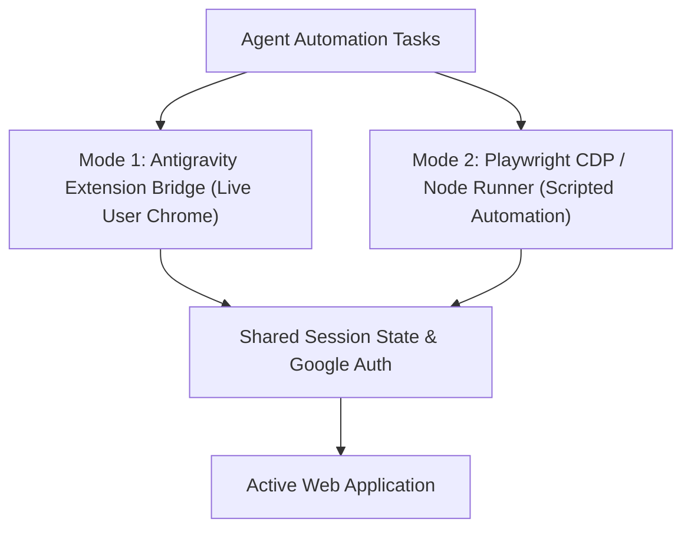

# Playwright Interactive: Deep Automation & Visual QA

While lightweight extension actions manage daily browsing tasks, complex test suites, multi-page data extraction, and pixel-perfect design audits require deep programmatic browser automation.

`playwright-interactive` unifies headless/headed Playwright scripts with Antigravity's persistent native Chrome session, allowing stateful, resilient automation without re-authenticating every session.

---

## 1. Unified Hybrid Architecture

Antigravity operates in two synchronized browser modes:



- **Mode 1 (Live Bridge)**: Drives the user's running Chrome window via `mcp_antigravity_browser_*` tools with 24/7 cursor persistence. Ideal for interactive tasks, authenticated enterprise portals, and direct user oversight.
- **Mode 2 (Playwright / CDP Runner)**: Drives persistent browser contexts via Node.js scripts for multi-step batch flows, parallel audits, and visual regression pipelines.

---

## 2. Interactive QA Execution Lifecycle

### Phase 1: Context Preparation & Cookie Re-use
Always preserve authentication and user sessions across runs:
- Store and reuse storage state (`cookies.json` and `localStorage`).
- Point Playwright to the user's persistent user-data-directory when interacting with authenticated corporate intranets.

### Phase 2: Viewport & Device Matrix Testing
Audit layouts across standard breakpoints:
- **Desktop (Standard)**: 1440 × 900
- **Laptop (Compact)**: 1280 × 800
- **Tablet**: 768 × 1024
- **Mobile (Large)**: 390 × 844 (iPhone 14/15 equivalent)

### Phase 3: Interactive State Verification
For every critical interactive flow:
1. Trigger action (hover, click, form submit, drag).
2. Wait for network idle or explicit DOM assertion (`waitForSelector`).
3. Assert visual feedback: focus rings, error badges, active tab underlines.
4. Capture normalized screenshot.

---

## 3. Playwright Script Execution Pattern

Run headless or headed Playwright scripts locally using node:

```javascript
import { chromium } from 'playwright';

(async () => {
  // Connect to persistent user Chrome or launch isolated context
  const browser = await chromium.launch({ headless: true });
  const context = await browser.newContext({
    viewport: { width: 1440, height: 900 },
    deviceScaleFactor: 2
  });
  const page = await context.newPage();

  // Navigate and wait for network stability
  await page.goto('http://localhost:3000', { waitUntil: 'networkidle' });

  // Assert title and key elements
  const title = await page.title();
  console.log(`Page Title: ${title}`);

  // Capture clean normalized screenshot
  await page.screenshot({ path: 'audit-desktop.png', fullPage: true });

  await browser.close();
})();
```

---

## 4. Deep-Dive References

- **[Persistent Sessions & State Management](references/persistent-sessions.md)**: Preserving authentication, cookies, and local storage without re-login prompts.
- **[Comprehensive QA Checklist](references/qa-checklists.md)**: 30-point QA verification checklist for modern web apps before shipping.
- **[Viewport Fit & Overflow Auditing](references/viewport-fit-audits.md)**: Detecting horizontal scroll leaks, clipping, and broken flexbox containers.
- **[Screenshot Normalization](references/screenshot-normalization.md)**: Freezing CSS animations, waiting for web fonts, and sub-pixel alignment for visual diffing.
