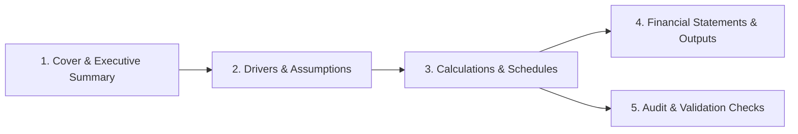

# Spreadsheets Mastery: Institutional Modeling & Design

Spreadsheets are the software of modern business. Poorly structured spreadsheets with hardcoded numbers, broken formulas, and garish default colors undermine trust and create catastrophic modeling errors.

The `spreadsheets-mastery` skill provides the standards, architectural blueprints, formula patterns, and visual design systems used by top investment banks, management consultancies, and high-growth technology companies.

---

## 1. The FAST Modeling Standard

Every model built under this skill follows the **FAST** principles:
- **Flexible**: Able to adapt to new periods, scenarios, and structural changes without rewriting core logic.
- **Appropriate**: Detail matches the decision at hand; avoids unnecessary complexity that obscures key drivers.
- **Structured**: Consistent layout across all worksheets, standardized formula conventions, and separated calculation blocks.
- **Transparent**: Formulas are simple, readable, and auditable. Never embed unexplained hardcoded assumptions inside formulas (e.g. use `=B4*(1+$C$2)` where `C2` is explicitly labeled "Tax Rate", NOT `=B4*1.21`).

---

## 2. Workbook Architecture: The 4-Tier Hierarchy

Professional workbooks strictly isolate concerns across dedicated worksheets:



1. **Cover & Executive Summary**: High-level KPIs, executive narrative, sensitivity tables, and scenario switches (Base / Bull / Bear).
2. **Assumptions & Inputs**: Pure user inputs. Every cell that can be tweaked lives here and is colored with an input flag (Standard: Light Blue background `#E8F0FE` or blue font `#1A73E8`).
3. **Calculations & Schedules**: Depreciation waterfalls, debt amortization, revenue builds, and headcount schedules.
4. **Outputs & Financial Statements**: Income Statement, Balance Sheet, Cash Flow Statement, or operational dashboards.
5. **Audit & Validation**: Integrity tests (Assets - Liabilities - Equity = 0, checksums, duplicate detection).

---

## 3. Financial Modeling Formula Standards

### A. Dynamic Lookups & References
- **Use `XLOOKUP` over legacy `VLOOKUP`**:
  ```excel
  =XLOOKUP(A2, Products!A:A, Products!D:D, "Not Found", 0)
  ```
  `XLOOKUP` will not break when new columns are inserted, supports reverse lookups, and provides native default handling.

- **Two-Way Lookups with `INDEX / MATCH`**:
  ```excel
  =INDEX(DataGrid, MATCH(RowTarget, RowHeaders, 0), MATCH(ColTarget, ColHeaders, 0))
  ```

### B. Safe Aggregation & Error Trapping
- Always wrap lookup and division formulas with `IFERROR` or `IFNA` to keep sheets clean of `#N/A` or `#DIV/0!`:
  ```excel
  =IFERROR((Revenue - Cost) / Revenue, 0)
  ```
- Use `SUMIFS` / `COUNTIFS` for multi-criteria aggregations instead of volatile array formulas:
  ```excel
  =SUMIFS(Orders!E:E, Orders!B:B, "Completed", Orders!C:C, ">=2026-01-01")
  ```

---

## 4. Visual Design Profiles

Never use default raw spreadsheets with unformatted numbers or bright primary colors. Choose from one of three calibrated design profiles:

| Profile | Primary Header | Accent / Highlight | Zebra Stripe Fill | Font Family | Best For |
|---|---|---|---|---|---|
| **Classic Navy** | Dark Navy (`#1B365D`) | Steel Blue (`#4A90E2`) | Off-white (`#F8F9FA`) | Arial / Roboto | Corporate Finance, M&A, Banking |
| **Slate Minimal** | Deep Charcoal (`#212529`) | Cool Gray (`#6C757D`) | Light Gray (`#F1F3F5`) | Inter / Segoe UI | Tech Startups, SaaS metrics, Engineering |
| **Modern Emerald** | Forest Spruce (`#134E4A`) | Mint (`#10B981`) | Mint Tint (`#F0FDF4`) | DM Sans / Calibri | ESG, Operations, Supply Chain |

---

## 5. Number Formatting Rules

Every number in a spreadsheet MUST have an intentional format:
- **Currency**: `$#,##0` (rounded) or `$#,##0.00` (cents for unit costs).
- **Percentages**: `0.0%` or `0.00%` (never leave as raw decimals like `0.1423`).
- **Dates**: `YYYY-MM-DD` (ISO) or `MMM YYYY` (e.g. `Jan 2026`).
- **Negative Numbers**: Accounting format `($#,##0)` or red parentheses.
- **Zero Values**: Display as a clean dash `-` using custom format `_($* #,##0_);_($* (#,##0);_($* "-"_);_(@_)`.

---

## 6. Deep-Dive References

- **[Workbook Architecture Guide](references/workbook-architecture.md)**: Tab-by-tab layout, navigation links, and naming conventions.
- **[Formula Patterns & Edge Cases](references/formula-patterns.md)**: Production formula templates for amortizations, CAGR, IRR, and dynamic arrays.
- **[Style Profiles & Color Palettes](references/style-profiles.md)**: Complete hex swatches, border hierarchies, and typography guidelines.
- **[Validation & Auditing](references/validation-and-auditing.md)**: Automated checksums, error gates, and circularity breakers.
